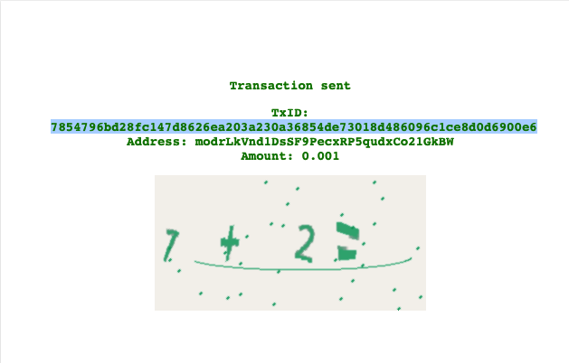
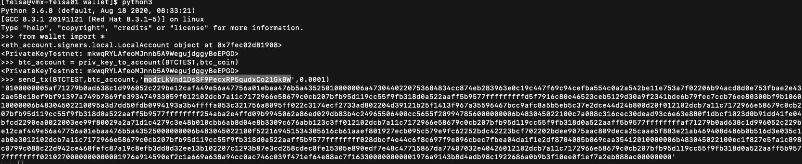
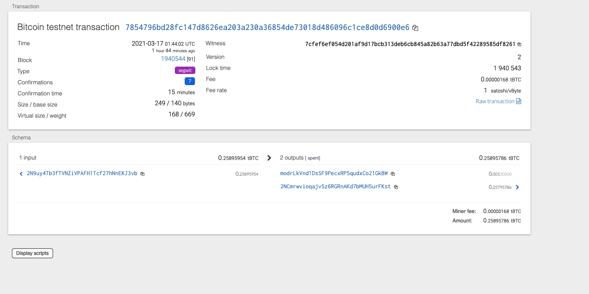

This homework was hell :D

The wallet leverages HD wallet derive to create wallets to transact BTC/ETH

BTC

Eth 

Couldnt figure out how to get gas

WARN [03-16|19:51:30.500] Served eth_estimateGas                   conn=127.0.0.1:58127 reqid=8                                t="131.749µs" err="err: insufficient funds for transfer: address 0x6FaaA0c6cBE8ecA640D902B5B0a8E964fe30C196 (supplied gas 2365090)"
INFO [03-16|19:51:30.792] Looking for peers                        peercount=1 tried=49 static=0
WARN [03-16|19:51:34.328] Served eth_estimateGas                   conn=127.0.0.1:58127 reqid=9                                t="123.446µs" err="err: insufficient funds for transfer: address 0x6FaaA0c6cBE8ecA640D902B5B0a8E964fe30C196 (supplied gas 2365090)"
INFO [03-16|19:51:40.926] Looking for peers                        peercount=1 tried=50 static=0
INFO [03-16|19:51:51.304] Looking for peers                        peercount=1 tried=25 static=0

ValueError: {'code': -32000, 'message': 'err: insufficient funds for transfer: address 0x6FaaA0c6cBE8ecA640D902B5B0a8E964fe30C196 (supplied gas 2365090)'}
>>> eth_account = priv_key_to_account(ETH,eth_coin)
<eth_account.signers.local.LocalAccount object at 0x7fbd981da220>
>>> send_tx(ETH,eth_account,'0xFf7f862FB5930126305E7935b02058551804B2b2',1)
Traceback (most recent call last):
  File "<stdin>", line 1, in <module>
  File "/Users/freddieeisa/nu-chi-fin-pt-10-2020-u-c/wallet/wallet.py", line 60, in send_tx
    tx = create_tx(coin,account, recipient, amount)
  File "/Users/freddieeisa/nu-chi-fin-pt-10-2020-u-c/wallet/wallet.py", line 44, in create_tx
    gasEstimate = w3.eth.estimateGas(
  File "/Users/freddieeisa/anaconda3/lib/python3.8/site-packages/web3/module.py", line 58, in caller
    result = w3.manager.request_blocking(method_str, params, error_formatters)
  File "/Users/freddieeisa/anaconda3/lib/python3.8/site-packages/web3/manager.py", line 158, in request_blocking
    raise ValueError(response["error"])
ValueError: {'code': -32000, 'message': 'err: insufficient funds for transfer: address 0x6FaaA0c6cBE8ecA640D902B5B0a8E964fe30C196 (supplied gas 2365090)'}
